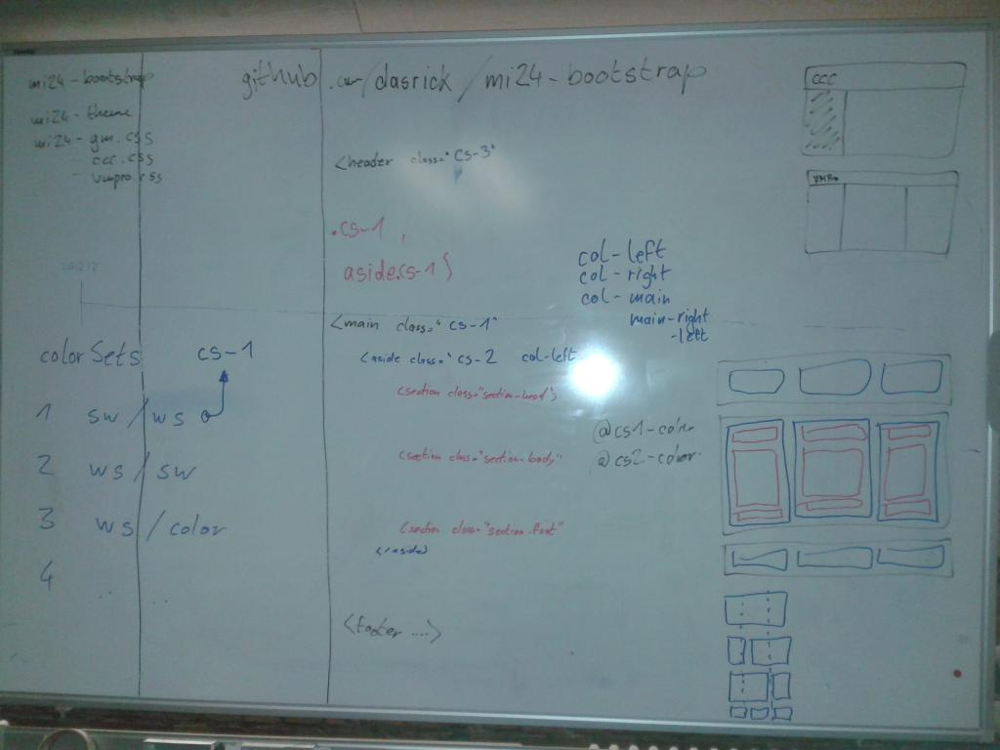

### This repository is deprecated!

### The relevant repository can be found here [mi24-bootstrap](https://github.com/movingimage-evp/mi24-bootstrap)

# mi24-bootstrap

The basics for usage of twitter bootstrap in ui project of movingimage24.

This package include the latest version of twitter bootstrap ... currently version 3.3.6

## Implementation

via npm or bower ... [please more details]

    "dasrick/mi24-bootstrap": "~0.3.0"

First append the gruntfile to copy both minified files into distribution folder (in our example media/css).
Now add these lines in head part of html page.

    <link rel="stylesheet" href="media/css/mi24-bootstrap.min.css"/>
    <link rel="stylesheet" href="media/css/mi24-theme.min.css"/>

## Development

Just start with installation of required dev tool.

    npm install

After that just run commands like ...

    npm run build
    npm run build:css
    npm run build:css-theme
    
    npm run watch
    
To start the express web server just do this ...

    npm run start
    
... and open [http://localhost:3000](http://localhost:3000)

## Tagging

Here is a good gist that explain all nessessary step for tagging the builds (git/npm)

* [Tagging](https://gist.github.com/coolaj86/1318304#beta-and-release-versions)

The short version for bumping new version to `npm` looks like this ...

    npm publish ./
    
The short version for creating a `git tag` looks like this ...

    git tag 0.1.4 master
    git push --tags
    
npm used for versioning the version number from the package.json. bower use the tags from git repository.

## Concept Overview

## thx

* to [shields.io](http://shields.io/) for most of the badges ...

